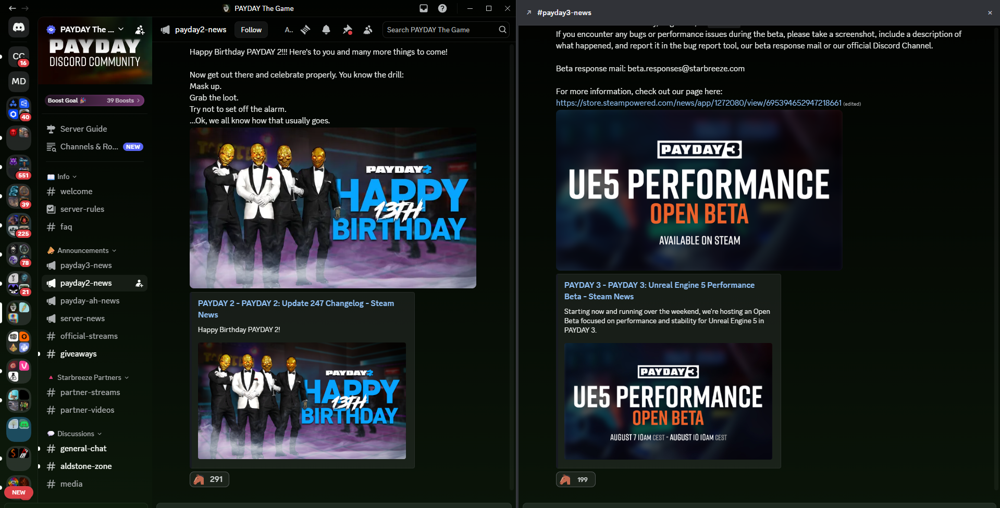

# SplitView for BetterDiscord

SplitView adds a persistent right-side Discord chat pane. Keep one channel or
thread open beside your normal Discord view without replacing the main chat.

SplitView is native-first: Discord still owns message rendering, the composer,
typing indicators, slash commands, and channel/thread state. SplitView only
mounts Discord's own sidebar chat surface into a second pane.



Example: keep one Discord channel open in the main view while another channel stays visible in the right-side SplitView pane.

## Install

No build step is required.

Windows (PowerShell):

```powershell
iwr "https://raw.githubusercontent.com/DylDigitals/Splitview-BD/main/SplitView.plugin.js" -OutFile "$env:APPDATA\BetterDiscord\plugins\SplitView.plugin.js"
```

Or download `SplitView.plugin.js` and drop it into your BetterDiscord plugins
folder manually.

Then reload Discord with `Ctrl+R` and enable **SplitView** in BetterDiscord
settings.

## Use

Right-click a supported channel or thread and choose **Open in Split View**.

The pane can be resized, closed, docked, or floated. Your width and floating
position are remembered locally. The active split target is session-only: a
renderer reload can restore it, but a full restart will not resurrect a stale
pane.

## Supported targets

- Guild text channels
- Announcement channels
- Public, private, and news threads

Not supported in this release: DMs, group DMs, forums, and voice channels.

## Troubleshooting

Open Discord DevTools with `Ctrl+Shift+I` and use the debug helpers:

```js
SplitViewDebug.dumpStatus()      // pane state, render mode, active target, settings
SplitViewDebug.inspectPane()     // DOM evidence for the mounted pane
SplitViewDebug.discoverModules() // Discord internal module discovery table
SplitViewDebug.printCrashLog()   // recent local diagnostic events
SplitViewDebug.copyCrashLog()    // same, to clipboard, for bug reports
SplitViewDebug.resetSettings()   // start clean if the pane misbehaves
```

If the pane fails to mount after a Discord update, `discoverModules()` output is
the most useful thing to attach to an issue.

## Privacy

Crash diagnostics are local-only. SplitView sends no telemetry and no message
content anywhere.

## License

MIT — see `LICENSE`.

